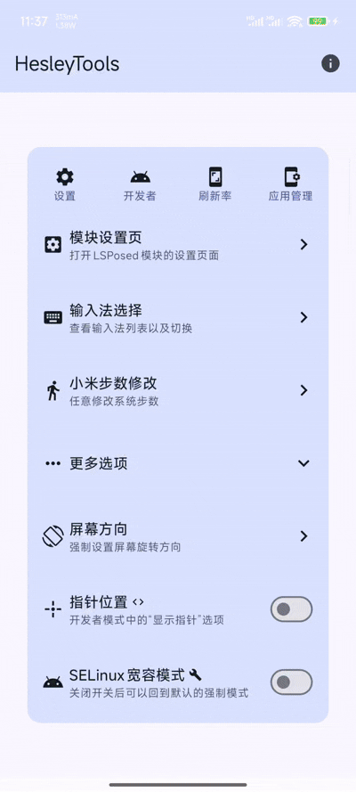
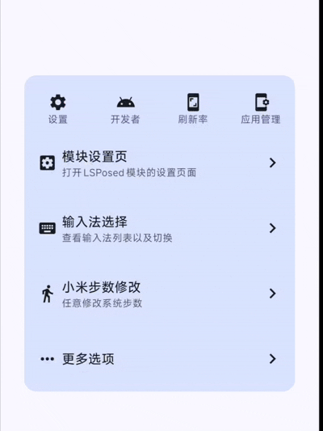
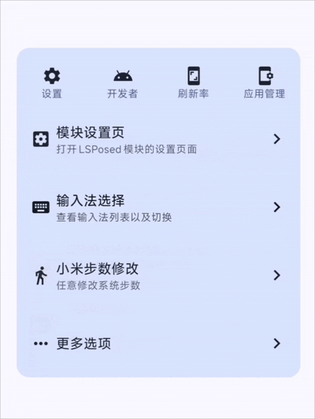

# 自用工具箱-HesleyTools


## 项目介绍

有时候需要自己开发一些小工具来优化日常手机使用体验，特此开发了该项目。

Android入口：app模块

Magisk/KernelSU模块：./Modules 目录下

## 使用展示

|            隐藏后台清理按钮             |          输入法操作           |
|:-------------------------------:|:------------------------:|
|  |  |

|           屏幕方向操作            |           小米刷步数            |
|:---------------------------:|:--------------------------:|
|  |  |

### 项目功能

#### 快捷功能弹窗

在控制中心中添加一个小按钮，点击后可以弹窗一个快捷菜单，提供了一些日常使用的小功能。

- 快捷打开 设置页、开发者选项、刷新率页面(小米特有)
- 输入法快捷设置（启用或禁用输入法、快捷切换输入法）（需要root或Shizuku）
- 屏幕方向强制修改快捷设置（需要root或Shizuku）
- 小米步数修改
- 快捷设置 SELinux宽容模式/强制模式 （需要root）
- ...

#### 自动化测试脚本

提供了自动化测试脚本的模版和环境，以用kotlin编写的adb shell测试脚本为例，稍作修改即可实现电脑安卓双端运行。

### TODO-未来计划

- 最近任务页面隐藏侧边栏（依赖LSPosed）
- dynamicSpot修改到小米灵动提示下层
- 控制中心显示步数
- 桌面状态下隐藏小白条
- ...

### Magisk/KernelSU 模块

#### 自用澎湃增强模块

- 手势小白条跟随应用
- 锁屏界面禁止显示手势小白条

## 项目技术介绍

### 项目架构

本项目将代码分出了多个模块。

#### 业务 + UI 层

- app：主工程模块，也是 app 打包入口。
- app_lsposed： LSPosed 功能模块，所有 LSPosed 功能都在此模块，该模块被 app 依赖集成。

#### 业务支持层

- lib_bu_common：作为给各个业务层模块提供公共能力的基础模块，该模块提供公共能力，比如全局
  Context、AppBuildInfo、一些基础数据、接口、工具等。该模块和业务有关联，不能直接作为基础库。

#### 基础支持层

- lib_base_shell：作为提供 Shell 能力的基础模块，该模块提供执行 Shell 能力，集成了 root、Shizuku 等能力。技术可参考博主这篇帖子:[Android执行Shell命令](https://blog.csdn.net/Hunter_chemistry/article/details/146188990?spm=1001.2014.3001.5501)
- lib_oem_sdk：提供了一些系统源码的对外 API 暴露，主要是为了写 LSPosed 模块的时候用，不过目前并没有被依赖进主工程。

### 开发环境

- 开发工具：IntelliJ IDEA (2022.2.1) / Android Studio (Ladybug)
- Gradle JVM Version: 21.0.3
- Android 配置：见 gradle.properties

# 注意

仅供技术学习交流，严禁用于非法用途。一切违法行为后果自负！

## Licenses

```
 Copyright 2022 original author or authors.
 Licensed under the Apache License, Version 2.0 (the "License");
 you may not use this file except in compliance with the License.
 You may obtain a copy of the License at
     http://www.apache.org/licenses/LICENSE-2.0
 Unless required by applicable law or agreed to in writing, software
 distributed under the License is distributed on an "AS IS" BASIS,
 WITHOUT WARRANTIES OR CONDITIONS OF ANY KIND, either express or implied.
 See the License for the specific language governing permissions and
 limitations under the License.
```